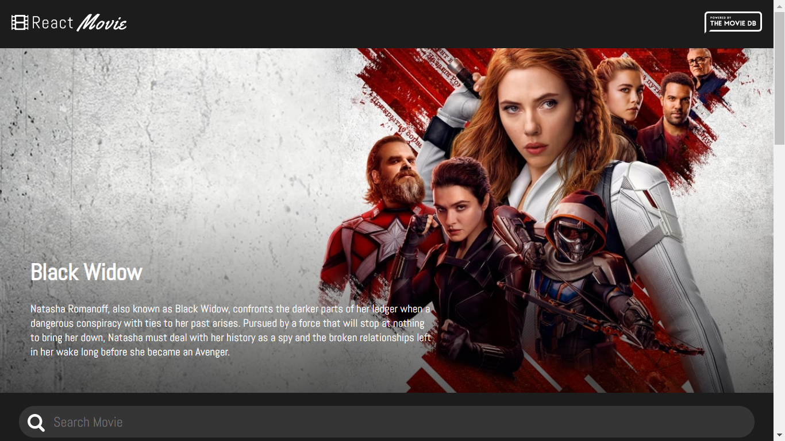
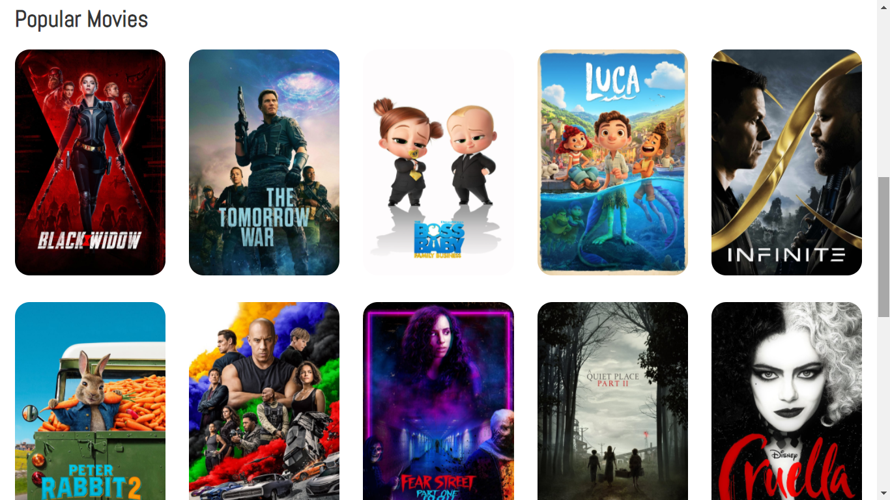
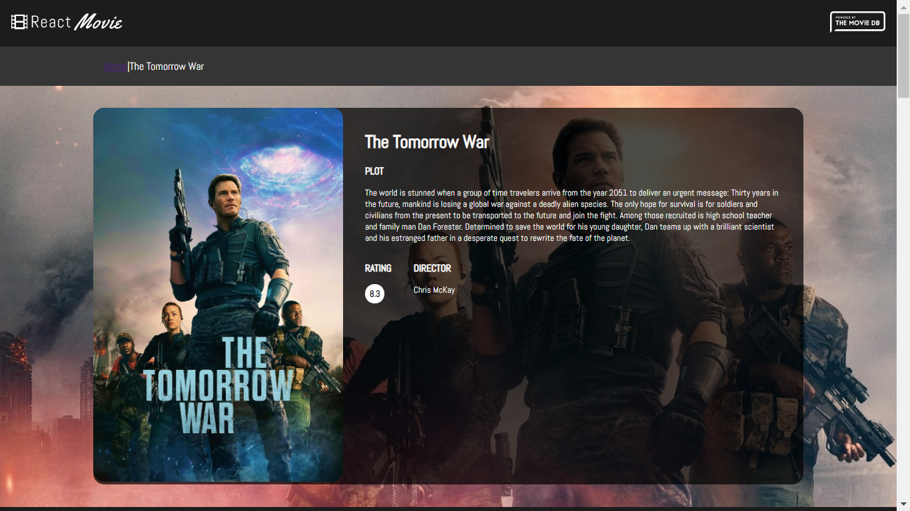
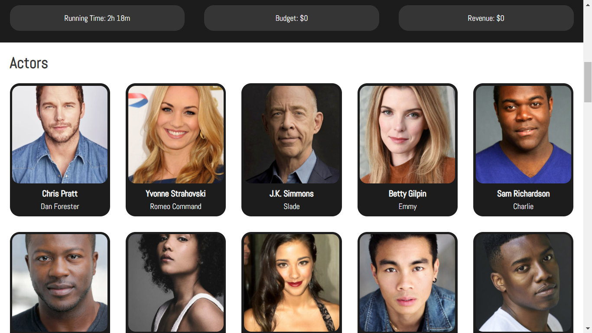

<h1 align=center>React Movie Database</h1>

## [DEMO](https://react-movie-app-project.netlify.app/)

- I developed a responsive movie database web app using React and the TMDB API, featuring a trending movie carousel, a display of top-rated movies, and detailed movie information pages with React Router v6. The application incorporates user login functionality and enables movie ratings using TMDB accounts. To enhance performance, a persistent state is implemented with session storage. The tech stack includes React, React Router v6, React Hooks, Custom Hooks, and the TMDB API.

## Refactored Code Using **Typescript** : [GitHub-Repo](https://github.com/cenacrharsh/react-movie-app-typescript)

## Lessons Learned

- API USED: TMDB API
- Using Syled Components for Styling
- Used React-Routers
- React Hooks Used: `useState()` `useEffect()` `useRef()` `useCallback()` `useContext()` `useNavigate()`
- Created Custom React Hooks
- used `PropTypes`
- Persistant state using **Session Storage** in Browser to improve Performance
- used Global Context to add Login Functionality and Rating the movies (using TMDB account)
